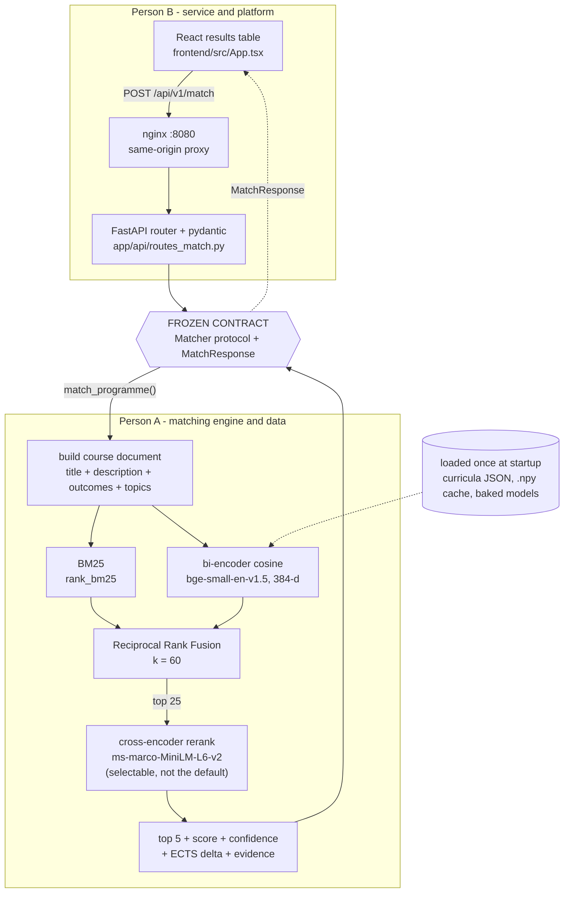
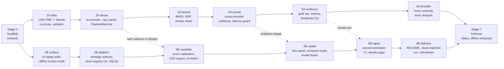

# Project map

One page to orient a new reader or a fresh agent. The authoritative board is
`TASKS.md`; this file is the picture of it.

## Request path and the ownership boundary

Only a pydantic model and a protocol method cross the boundary. Person B builds the
whole surface against `StubMatcher`; Person A replaces it behind the same two methods
without touching a file Person B owns.

## Stages and lanes

Each stage has two lanes that never touch the same files. A stage closes when both
lanes pass their gate. Per-task detail is in `TASKS.md`.

The dotted edges are the only cross-lane dependencies in the whole plan, and each one
is against a shape that is already frozen in `app/schemas/`, so neither lane has to wait.

## Who owns what

| Layer | Tool | Owner |
|---|---|---|
| Embeddings | sentence-transformers, `BAAI/bge-small-en-v1.5` | A |
| Baseline | `sentence-transformers/all-MiniLM-L6-v2` | A |
| Lexical | `rank_bm25` | A |
| Fusion | Reciprocal Rank Fusion, k = 60 | A |
| Reranking | `cross-encoder/ms-marco-MiniLM-L6-v2`, selectable, not the default (ADR-0005) | A |
| Vector maths | NumPy exact cosine, no vector database | A |
| GPU work | Colab T4, evaluation sweep and optional fine-tune | A |
| API | FastAPI, uvicorn, pydantic v2 | B |
| UI | React 18, Vite, TypeScript | B |
| Web server | nginx, same-origin proxy | B |
| Persistence | SQLAlchemy 2.0, SQLite | B |
| Packaging | Docker Compose, CPU torch wheels, models baked in | B |
| CI | GitHub Actions: ruff, pytest, frontend build, style check | B |
| Contract | `Matcher` protocol, `app/schemas/` | shared |
| Curriculum schema | `docs/03-data-schema.md` | shared |
